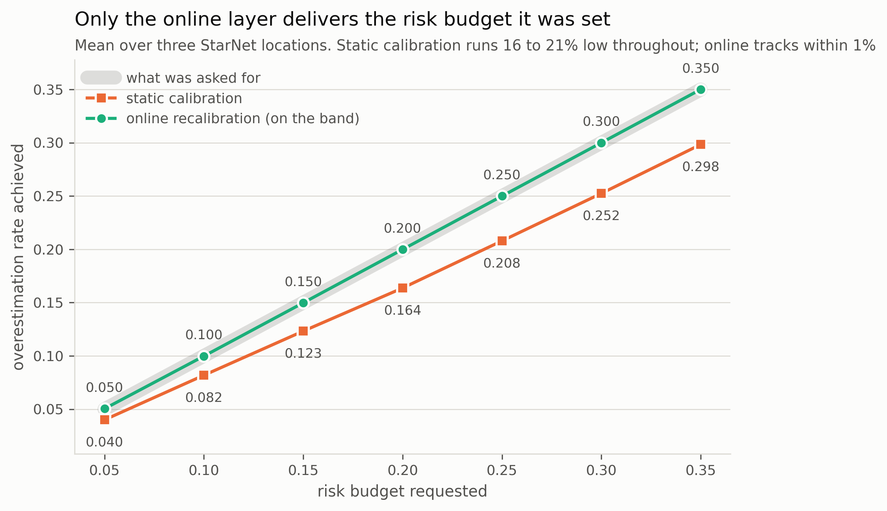
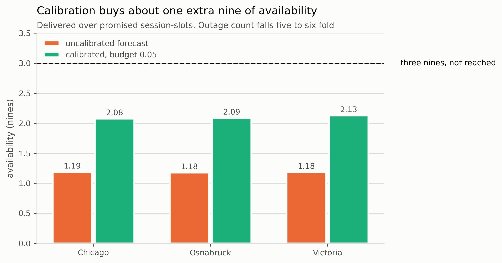
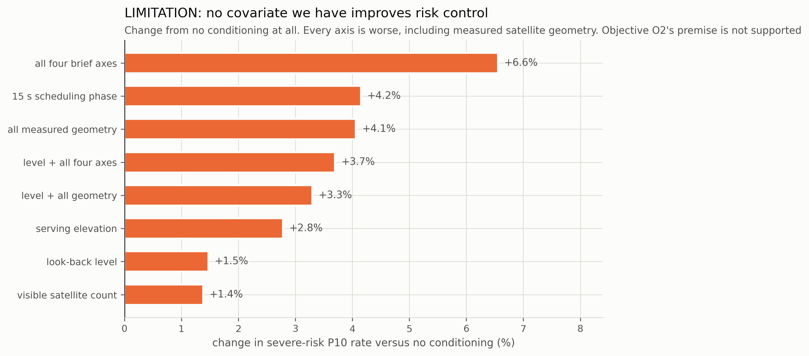
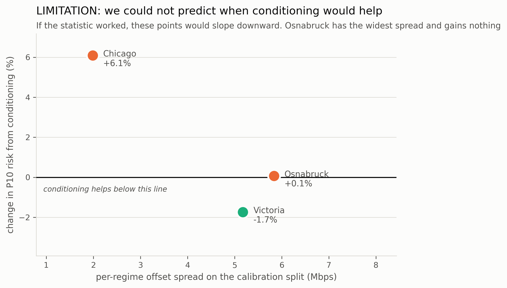

# flwcnx

**Risk-controlled throughput forecasting and bandwidth allocation for Starlink
(LEO satellite) access links.**

[](https://github.com/Mayan10/flwcnx/actions/workflows/ci.yml)
[](https://www.python.org/downloads/)
[](https://github.com/astral-sh/ruff)
[](tests/)
[](LICENSE)
[](docs/paper/report.md#4-reproduction-gates)

Mayan Sharma, Kriti Saini, Devansh Behl

---

The system forecasts downlink throughput one horizon ahead, converts that point
forecast into a *safe lower bound* whose overestimation rate is held at a stated
risk budget, and drives admission control and congestion alerts from that bound.

Three of the six problems in the brief are addressed, chosen because they chain
into a single system rather than three disconnected models:

1. Predict throughput degradation (the forecaster).
2. Detect congestion before users are affected (derived from the bound, not a
   separate classifier).
3. Optimize bandwidth allocation automatically (the decision layer).

## Read this first

| | |
|---|---|
| **Paper** | [`docs/paper/paper.md`](docs/paper/paper.md) - the reproduction and evaluation study, with the five findings in section 1.1 |
| **Report** | [`docs/paper/report.md`](docs/paper/report.md) - the whole system, the four objectives, and how the data was obtained |
| **Results** | [`results/summary/`](results/summary/) - every committed table, each traceable to a run with its config snapshot |
| **Limitations** | [`docs/limitations.md`](docs/limitations.md) - written while building, not retrofitted |
| **Novelty audit** | [`docs/novelty-review.md`](docs/novelty-review.md) - independent literature check that withdrew our methods claim |

**What is new here is empirical, not algorithmic.** The mechanisms evaluated in
this project are all published and are cited as such. The findings are ours.
See [Contribution boundary](#contribution-boundary).

## What was learned

Three figures. Every number is read from a saved `result.json`, and
`scripts/make_readme_figures.py` regenerates all of them at 300 DPI.

### A published method silently ignores tight risk budgets


BG-CFQS, the state of the art for safe Starlink throughput forecasting, selects
its operating point from a candidate quantile set of `T = [0.15, 0.40]`. Ask it
for a budget tighter than the low end of that set and its search interval
collapses to a point, so it returns the same quantile however small the budget
gets. **The achieved rate is identical at 0.05, 0.10 and 0.15 on all four
datasets**, overshooting by up to 3.7x at the tightest.

Their own evaluation runs at a single budget of 0.35, where the floor never
binds, so it cannot surface from their results. Verified from their Algorithm 1,
confirmed against their Table II, and measured here.

A budget of 0.35 permits over-promising on more than a third of decisions. The
tight budgets are the operationally interesting ones, and they are the ones the
method cannot serve.

### Only the online layer delivers the budget it was set



A risk budget is a dial the operator sets. Static split conformal does not
deliver it: on these traces it runs 16 to 21% **low** at every point, and on
WetLinks it runs 20% **high**. The direction is a property of the link's drift,
not of the method, and neither miss is safe: over-promising drops sessions,
under-promising silently withholds capacity the operator said it would risk.

Online recalibration tracks within 1% everywhere, and the same holds on latency
with the bound direction flipped.

### Calibration buys about one extra nine



Translated into the terms a carrier SLA is written in: calibration moves the
link from roughly one nine to two, cuts the number of outages five to six fold,
and shortens the mean outage from about nine seconds to five.

**No policy reaches three nines.** An operator wanting 99.9% on this link cannot
get there by forecasting better.

Whether that is worth buying depends on prices. Under commodity pricing the
aggressive policy is cheapest, because foregone revenue accrues on every unsold
session-hour while credits only bite below three nines. So the model reports the
invariant instead: **a violated session-hour must cost 3.87x, 3.92x or 4.05x a
sold one** (Chicago, Osnabruck, Victoria) before risk control pays. Consumer
broadband does not clear 4x; enterprise and URLLC do.

## Where this work fails

Three more figures, given equal room. Two of these overturned claims the project
had already made, which is why they are here rather than in a footnote.

### No covariate we have improves risk control



The project was designed around conditioning the calibration on operating
regime. On the StarNet traces, with satellite geometry **measured** rather than
reconstructed, every axis is worse than not conditioning at all, including the
elevation, distance and visible-satellite-count that objective O2 expected to
carry the signal.

StarNet establishes that those covariates correlate with throughput *level*, and
we reproduce that. They carry no *residual* structure, which is what a
calibration layer needs. **Objective O2's premise is not supported.**

Robust to the learning rate: across seven values spanning two orders of
magnitude, conditioning beat no conditioning in 8 of 42 cells, seven of them one
location.

### We could not predict when conditioning would help



Conditioning helps on one link and hurts on three, so we built a test to decide
which case a trace is in, using only the calibration split. It does not work.

If the statistic predicted the outcome these points would slope downward.
Osnabruck has the **widest** pre-test spread and gains nothing; Victoria has a
narrower one and is the only link that benefits.

We had previously reported this relationship as monotonic across four datasets.
Those figures were post-hoc, taken from offsets applied *during* the test
period. Recomputed correctly on the calibration split the ordering breaks. The
claim is withdrawn, with `results/summary/gate-negative-result.md` explaining
how it survived five files before being caught.

### Congestion alerts fire early, and often wrongly


Congestion is derived from the calibrated bound rather than modelled separately,
which is what makes it nearly free. It satisfies the literal requirement:
warning leads run 12 to 138 decision slots, so the alarm does fire before users
are affected.

It is also the weakest of the six requirements. Mean F1 is 0.459, and on
Victoria the alert is wrong roughly three times in four. A derived detector
inherits the bound's variance, and a trained classifier would likely beat it.
The design trade was taken deliberately for system coherence; its cost is here
rather than hidden.

## The reproduction gates, both passed

| gate | result |
|---|---|
| StarNet (Phase 1) | average RMSE 39.73 vs 39.30 published (+1.1%), MAE 29.97 vs 29.28 (+2.4%) |
| BG-CFQS (Phase 2) | under an exchangeable split: OverRate 0.340 vs 0.349, P30 0.671 (pub 0.65 to 0.71), P10 0.848 (pub 0.83 to 0.86), risk pass 3/3 |

Phase 2 passed only after `scripts/split_sensitivity.py` identified the split as
the confound. BG-CFQS's guarantee holds under the exchangeability it is derived
from and does not survive a temporal split; their paper does not claim
otherwise. The detail that matters: **P10 is 0.848 in the arm where the method
passes its budget 3/3**, so the conditional failure is intrinsic to global
quantile selection rather than a symptom of drift.

## Architecture

Six layers. Each layer only talks to the one below it.

```
ingest/     raw sources to a normalized frame     (no ML, no features)
state/      frame to feature vectors + regime id  (no model)
forecast/   feature vectors to point prediction   (StarNet backbone)
calibrate/  point prediction to safe lower bound  (the novel layer)
decide/     safe bound to allocation + alerts     (no ML)
eval/       harness, splits, metrics, figures
```

Two ingestion modes sit behind one interface. `ReplaySource` and the WetLinks
sources are the real path. `LiveSource` wires a terminal, a TLE feed and a
weather feed, and is a stub until a dish is available.

## Contribution boundary

Being precise about this matters more than anything else in the repo.

**Reproduced from published work, not ours:**

- the StarNet GRU seq2seq backbone with periodical embedding and attention
  (Liu et al., CoNEXT 2025);
- the 2D to 3D obstruction map projection and DTW based TLE matching for
  serving satellite identification (same paper);
- the BG-CFQS budget guided coarse to fine quantile selection baseline
  (Xie et al., 2026);
- the 15 second period segmentation and phase recovery (Casparsen et al., 2026);
- one-sided split conformal prediction (Vovk, Gammerman and Shafer);
- the adaptive conformal update rule `alpha <- alpha + gamma (eps - err)`
  (Gibbs and Candès, NeurIPS 2021);
- **running that update per covariate group**, which is GCACI (Ramalingam et
  al. 2025, arXiv:2502.10947), and which POGO (arXiv:2606.00419) improves on by
  removing the learning rate. `calibrate/adaptive.py` is the naive special case
  of GCACI and was built before this was known. See `docs/novelty-assessment.md`.

**Ours:** measurement, not method. A literature check on 2026-09-01
(`docs/novelty-assessment.md`) found that the calibration layer this project was
designed around is already published as GCACI, so the methods claim is withdrawn
in full. What the work contributes is evidence:

1. The first evaluation of risk-controlled capacity forecasting on LEO access
   links, across four datasets and two independent measurement campaigns.
2. **BG-CFQS's risk guarantee is conditional on exchangeability**: 3/3 within
   budget under a random split, 1/3 under a temporal one.
3. **BG-CFQS cannot serve a budget below 0.15.** Their candidate set is
   T = [0.15, 0.40], so achieved OverRate pins at 0.1854 for every tighter
   budget, a 3.7x overshoot at 0.05. Their paper reports only 0.35.
4. **Static calibration misses its budget in both directions**, over on
   WetLinks and under on StarNet, so the sign is a property of the drift rather
   than the method.
5. **Group conditioning helps only when the groups differ.** The attempt to
   predict *which* case a trace is in, from the calibration split, failed:
   `results/summary/gate-negative-result.md`. Reported as a negative.
6. **The satellite covariates do not carry the signal** when measured rather
   than reconstructed. Objective O2's premise is not supported.
7. **Casparsen's 15 s scheduling offset recovered independently** on three
   continents from a different signal at 1/500th of their sampling rate.

BG-CFQS selects one global quantile to hold the overestimation rate at the
budget. Their own results show this fails conditionally: against a budget of
0.35 they report a global OverRate of 0.349, but 0.65 to 0.71 on the lowest 30%
throughput subset and 0.83 to 0.86 on the lowest 10%. Risk is controlled on
average and lost precisely in the low capacity regime where over allocation
actually drops sessions. **That failure reproduces here on independent data**:
the uncalibrated forecaster runs at 0.505 globally and 0.841 at P10.

## Install

```bash
python -m pip install -e ".[dev]"
python -m pip install -e ".[orbital]"   # SGP4, for the geometry reconstruction
```

## Data

Nothing in `data/` is versioned.

**The StarNet traces are unavailable.** All three OneDrive links in their repo
have expired and the authors did not respond. `docs/data-access.md` records
every route that was checked and the workaround that was taken instead: the
full WetLinks release (https://github.com/sys-uos/WetLinks) supplies 1.02M
per-second *measured capacity* samples, which substitutes for the traces on
everything except serving satellite identity.

```bash
python scripts/download_data.py --dataset starnet --dest data/starnet
python scripts/download_data.py --inspect data/supplied
python scripts/fetch_elements.py            # Space-Track, needs .env credentials
```

## Status and what is not done

- **The reproduction gates were never run.** StarNet's RMSE/MAE table and
  BG-CFQS's average table both need the traces. Phases 1 and 2 remain open, and
  **no number in this repo is comparable to a published one**. The 15 sample
  iperf run also caps look-back plus horizon at 15, so StarNet's 30/5 and
  BG-CFQS's 75/15 cannot be run here regardless.
- Cross location means two European sites 150 km apart measured by the same
  instrument, not three continents.
- Satellite geometry is *reconstructed* from propagated orbital elements, never
  measured. Every row carries `geometry_source = "reconstructed"`.
- The online layer's budget control is empirical, not a finite sample
  guarantee, and it requires outcome feedback after each decision.
- `LiveSource.connect` still raises. No live terminal.

`docs/limitations.md` is the long version and is written to be read before the
results, not after.

## Reproducing every number

Every table in the paper, the report and `results/summary/` comes from one of
these. Each run writes `result.json` with a configuration snapshot beside it;
the figure and table generators recompute nothing.

```bash
pytest -q                                               # 235 tests, synthetic fixtures

python scripts/reproduce_starnet.py --location all      # gate 1: StarNet accuracy
python scripts/reproduce_bgcfqs.py --all --stride 15    # gate 2: BG-CFQS risk table
python scripts/split_sensitivity.py                     # the exchangeability finding
python scripts/gamma_sensitivity.py                     # learning-rate robustness
python -m flwcnx.eval.runner --location usa --stride 6  # the full calibration grid
python scripts/run_cross_site.py --held-out Enschede    # cross-site holdout
python scripts/run_demo.py --location canada            # the live replay demo

# the WetLinks path, which is how the project ran before the traces arrived
python scripts/run_wetlinks.py --release seconds --site Osnabruck --geometry \
    --epochs 30 --stride 1 --output results/final

python scripts/make_readme_figures.py                    # the six README figures, 300 DPI
python scripts/make_figures.py <run-dir>                # per-run figures from a saved run
python scripts/make_summary.py <run-dir> --out <file>   # committed markdown tables
python scripts/compare_backbones.py <run-dirs> --out <file>
```

Seeded throughout (default 1337) and the seed is recorded in every result file.

## Citing

If you use this code or its findings, see [`CITATION.cff`](CITATION.cff). Please
also cite the work being evaluated:

- **StarNet** (traces and forecast backbone): Liu, Reidys, Tanveer and Vasisht,
  *Vivisecting Starlink Throughput*, Proc. ACM Netw. 3(CoNEXT4), 2025.
- **BG-CFQS** (the direct baseline): Xie et al., *Risk-Aware Safe Throughput
  Forecasting for Starlink Networks*, arXiv:2605.09508, 2026.
- **WetLinks** (the second dataset): Laniewski et al., TMA 2024.

The full bibliography, 40 entries, is [`docs/references.bib`](docs/references.bib).

## Licence

MIT, see [`LICENSE`](LICENSE). The licence covers the code only. The datasets
are redistributed by their own authors under their own terms, and several
components here are reimplementations of published methods, identified as such
in their module docstrings.
