# flwcnx

**Risk-controlled throughput forecasting and bandwidth allocation for Starlink
(LEO satellite) access links.**

[](https://github.com/Mayan10/flwcnx/actions/workflows/ci.yml)
[](https://www.python.org/downloads/)
[](https://github.com/astral-sh/ruff)
[](tests/)
[](LICENSE)
[](docs/paper/report.md#4-reproduction-gates)

Mayan Sharma, Kriti Saini, Devansh Behl

---

> This is the research package. It is self-contained and every command below
> runs from this directory. The service, web console and terminal console built
> around it live at the repository root, described in
> [`../../README.md`](../../README.md).

The system forecasts downlink throughput one horizon ahead, converts that point
forecast into a *safe lower bound* whose overestimation rate is held at a stated
risk budget, and drives admission control, congestion alerts and per-flow rate
allocation from that bound. The last of those is what keeps shedding load from
halting the work that must not be halted.

Four of the six problems in the brief are addressed, chosen because they chain
into a single system rather than four disconnected models:

1. Predict throughput degradation (the forecaster).
2. Detect congestion before users are affected (derived from the bound, not a
   separate classifier).
3. Optimize bandwidth allocation automatically (the decision layer).
4. Decide *which* flow is throttled when capacity is short, so that shedding
   load does not halt the work that must not be halted (the protection layer).

The other two, service availability and operational cost, are measured rather
than optimised, in [`results/summary/requirements-1-5-6.md`](results/summary/requirements-1-5-6.md).

**What is new here is empirical, not algorithmic.** The mechanisms evaluated in
this project are all published and are cited as such. The findings are ours.
See [Contribution boundary](#contribution-boundary).

## Contents

- [Quickstart](#quickstart)
- [Documentation](#documentation)
- [What was learned](#what-was-learned)
- [Which flow gets throttled](#which-flow-gets-throttled)
- [Where this work fails](#where-this-work-fails)
- [The reproduction gates, both passed](#the-reproduction-gates-both-passed)
- [Architecture](#architecture)
- [Repository map](#repository-map)
- [Contribution boundary](#contribution-boundary)
- [Data](#data)
- [Running it on your machine](#running-it-on-your-machine)
- [Reproducing every number](#reproducing-every-number)
- [Using the protection layer](#using-the-protection-layer)
- [Project status](#project-status)
- [Citing](#citing)
- [Licence](#licence)

## Quickstart

```bash
git clone https://github.com/Mayan10/flwcnx.git
cd flwcnx/newml/flwcnx
python -m pip install -e ".[dev]"
python -m pip install -e ".[orbital]"   # SGP4, for the geometry reconstruction
python -m pip install -e ".[api]"       # FastAPI, for the decision stream server

pytest -q                               # 318 tests, no dataset and no GPU needed
```

The test suite runs entirely on synthetic fixtures, so a fresh clone is
verifiable before any data is downloaded. With the traces in place, the two
reproduction gates are one command each:

```bash
python scripts/reproduce_starnet.py --location all      # gate 1: forecast accuracy
python scripts/reproduce_bgcfqs.py --all --stride 15    # gate 2: the risk table
python scripts/run_demo.py --location canada            # end-to-end replay demo
python scripts/run_protection.py --location canada      # which flow gets throttled
python -m flwcnx.api.server --mode synthetic --port 8010  # stream decisions live
```

## Documentation

| | |
|---|---|
| **Paper** | [`docs/paper/paper.md`](docs/paper/paper.md) - the reproduction and evaluation study, with the findings in section 1.1 |
| **Report** | [`docs/paper/report.md`](docs/paper/report.md) - the whole system, the four objectives, and how the data was obtained |
| **Results** | [`results/summary/`](results/summary/) - every committed table, each traceable to a run with its config snapshot |
| **Limitations** | [`docs/limitations.md`](docs/limitations.md) - written while building, not retrofitted |
| **Progress log** | [`docs/progress.md`](docs/progress.md) - one entry per phase, including the two withdrawn claims |
| **Novelty audit** | [`docs/novelty-review.md`](docs/novelty-review.md) - independent literature check that withdrew our methods claim |
| **Data access** | [`docs/data-access.md`](docs/data-access.md) - every route checked to obtain the traces, and the workaround |
| **Protection layer** | [`flwcnx/decide/flows.py`](flwcnx/decide/flows.py) and [`flwcnx/decide/protect.py`](flwcnx/decide/protect.py) - the scorer and the allocator, both documented in full at the top of the file |

## What was learned

Four figures. Every number is read from a saved `result.json`, and
`scripts/make_readme_figures.py` regenerates all of them at 300 DPI. The
protection layer has [seven more](#which-flow-gets-throttled), from
`scripts/make_protection_figures.py`.

### A published method silently ignores tight risk budgets

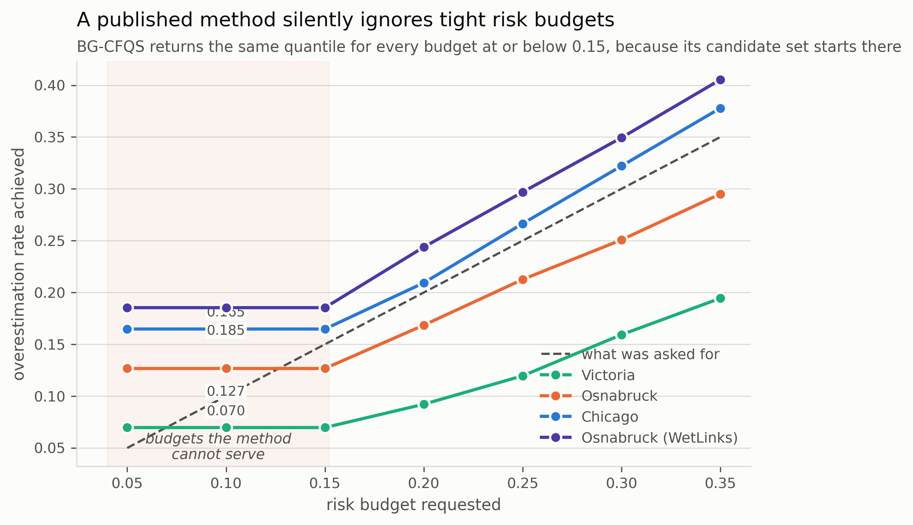

BG-CFQS, the state of the art for safe Starlink throughput forecasting, selects
its operating point from a candidate quantile set of `T = [0.15, 0.40]`. Ask it
for a budget tighter than the low end of that set and its search interval
collapses to a point, so it returns the same quantile however small the budget
gets. **The achieved rate is identical at 0.05, 0.10 and 0.15 on all four
datasets**, overshooting by up to 3.7x at the tightest.

Their own evaluation runs at a single budget of 0.35, where the floor never
binds, so it cannot surface from their results. Verified from their Algorithm 1,
confirmed against their Table II, and measured here.

A budget of 0.35 permits over-promising on more than a third of decisions. The
tight budgets are the operationally interesting ones, and they are the ones the
method cannot serve.

### Only the online layer delivers the budget it was set


A risk budget is a dial the operator sets. Static split conformal does not
deliver it: on these traces it runs 16 to 21% **low** at every point, and on
WetLinks it runs 20% **high**. The direction is a property of the link's drift,
not of the method, and neither miss is safe: over-promising drops sessions,
under-promising silently withholds capacity the operator said it would risk.

Online recalibration tracks within 1% everywhere, and the same holds on latency
with the bound direction flipped.

### Calibration buys about one extra nine


Translated into the terms a carrier SLA is written in: calibration moves the
link from roughly one nine to two, cuts the number of outages five to six fold,
and shortens the mean outage from about nine seconds to five.

**No policy reaches three nines.** An operator wanting 99.9% on this link cannot
get there by forecasting better.

Whether that is worth buying depends on prices. Under commodity pricing the
aggressive policy is cheapest, because foregone revenue accrues on every unsold
session-hour while credits only bite below three nines. So the model reports the
invariant instead: **a violated session-hour must cost 3.87x, 3.92x or 4.05x a
sold one** (Chicago, Osnabruck, Victoria) before risk control pays. Consumer
broadband does not clear 4x; enterprise and URLLC do.

### The 15 s scheduling phase is recovered, not assumed

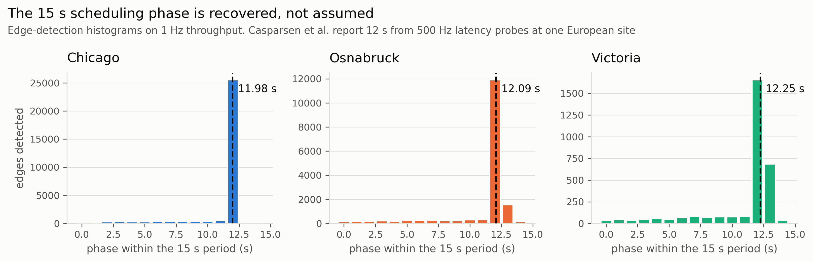

Casparsen et al. establish that Starlink reschedules at the 12th, 27th, 42nd and
57th second of each minute, from 500 Hz latency probes at one European site. Our
phase recovery never hardcodes that: it edge-detects on the first difference of
**throughput** at 1 Hz, and returns 11.98 s, 12.09 s and 12.25 s on three
continents.

The histogram is the point. An offset printed on its own is unfalsifiable; a
flat histogram beside a confident number is exactly the failure this figure
would expose, and these are not flat.

This is corroboration of someone else's result with a coarser instrument, not a
discovery: the 15 s throughput signature is already reported by Mohan et al.
(WWW 2024) and modelled by StarNet. It belongs here as evidence that the feature
layer is doing what it claims.

## Which flow gets throttled

Everything above treats the link as one pipe. The bound says how many megabits
the next horizon can be trusted to carry, and admission control turns that into
a session count. That is the right abstraction for measuring a forecaster and
the wrong one for shedding load, because it treats every megabit as
interchangeable. When the bound falls and something has to give, which megabit
is the entire question.

The answer a rate-based shaper implements is to throttle whatever is consuming
most. It is wrong in exactly the case that matters. A radiology study pushed to
a regional archive against a reporting deadline is a large, sustained,
single-direction transfer, and so is an operating system update.

**The capacity below is measured and the flows are a model.** Neither StarNet
nor WetLinks carries a flow table, process attribution or a user-attention
signal, and no public LEO dataset does, so the per-slot bound and realised
throughput come from a trained pipeline over the real traces and the flows
contending for them are generated by `flwcnx/eval/workload.py`. Every number in
this section is a number about that workload.
[`docs/limitations.md` section 4c](docs/limitations.md) is the long version and
includes the two points that cut against the layer.

### The same transfer, under both policies

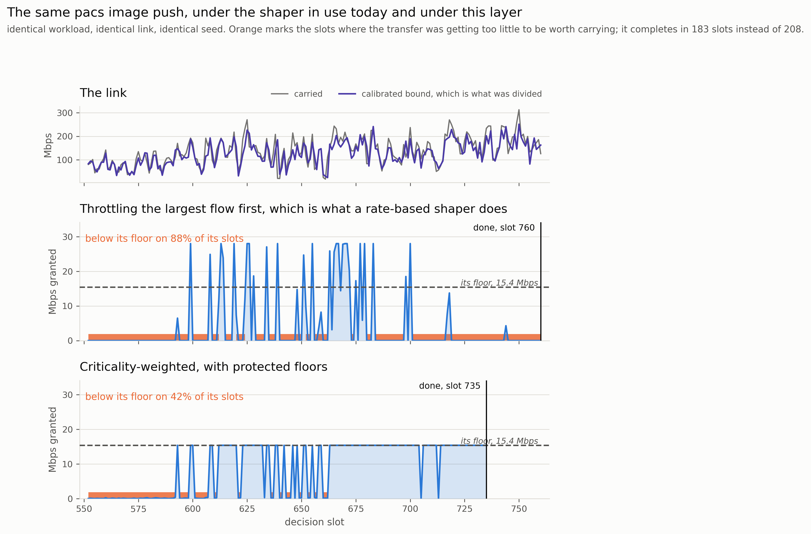

Identical workload, identical link, identical seed. The only difference is what
the allocator decided. Under the rate-based rule the radiology push is the
first thing against the wall and oscillates between nothing and its full rate;
under this layer it is pinned at the floor below which it is not worth carrying.

### It holds across the whole congestion range

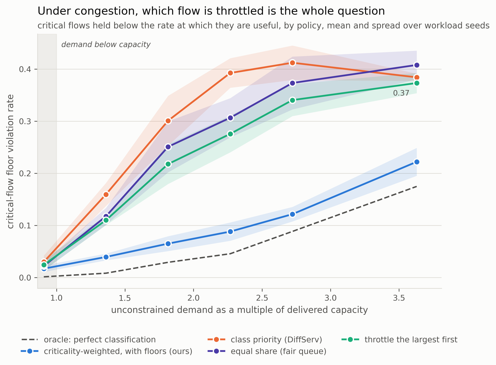

Victoria, 2,000 decisions, five workload seeds, at 2x nominal load. The flows
would ask for 1.8x what the link delivered if nothing constrained them:

| policy | critical transfers that **gave up** | floor violation rate | critical demand delivered |
|---|---|---|---|
| oracle, perfect classification | 0.0% | 0.029 | 74.6% |
| **criticality-weighted, with floors** | **0.3%** | **0.065** | **58.1%** |
| throttle the largest first | 12.1% | 0.218 | 47.4% |
| equal share (fair queue) | 13.0% | 0.251 | 50.8% |
| class priority (DiffServ) | 23.2% | 0.301 | 43.1% |

A transfer held below a useful rate for five minutes gives up, which is both
what real transfers do and what keeps the simulated backlog bounded. **One
critical transfer in three hundred gives up under this layer, against one in
four under class priority.** The sweep is the honest form: while demand sits
below capacity nothing has to be shed and every policy is within a point of
every other, and at 3.6x the floors stop fitting and the oracle itself violates
0.175.

The residual violations are not spread evenly. Of the four critical archetypes,
the patient monitor and the teleconsultation are held above their floors on
essentially every slot (0.001 and 0.000), the research upload on 94% of them,
and **almost all of what is left is the radiology push**, at 0.217. It is the
largest critical flow on the link, it does not declare itself, and it is the
first thing that stops fitting when the bound falls.

### The same result on all three links

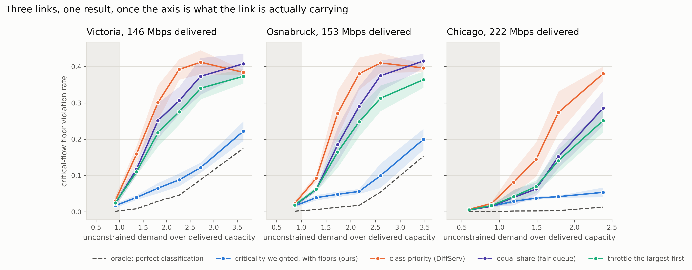

The three traces do not deliver the same capacity: Chicago carries about 222
Mbps against Victoria's 146. The same workload at the same nominal setting
therefore leaves one link comfortably under capacity and the other half as much
again over it, and **plotted against the workload's own load multiplier the
three panels look like three different results.** Plotted against how
oversubscribed each link actually is, they are one.

At the point where each link is carrying about 1.8x what its flows would ask
for unconstrained:

| link | ours | best baseline | oracle |
|---|---|---|---|
| Victoria, 146 Mbps | **0.065** | 0.218 (throttle largest) | 0.029 |
| Osnabruck, 153 Mbps | **0.048** | 0.165 (throttle largest) | 0.012 |
| Chicago, 222 Mbps | **0.042** | 0.141 (throttle largest) | 0.003 |

A property worth stating because it is not obvious: **when the link is not
short of capacity the layer does almost nothing.** On Chicago at 2x nominal
load, where demand sits at 1.2x delivered capacity, nothing is throttled, so
the elasticity channel has no experiment to read and the deadline channel sees
plenty of slack. The radiology push scores 0.24 instead of 0.72 and is not
protected, because nothing needs protecting. The layer is inert until
congestion makes it necessary.

### It is not free, and the figure says so

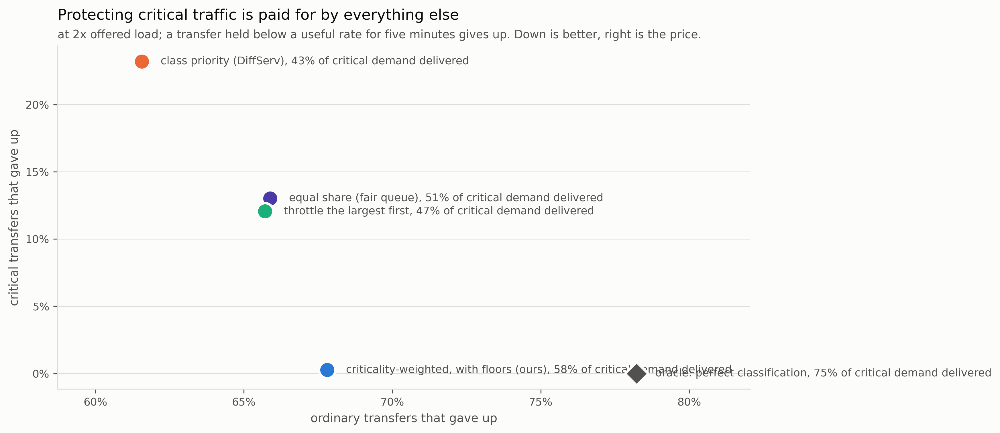

A layer that protected critical traffic by starving everything else would score
perfectly on the sweep above. Both axes here count transfers that gave up, so
the trade needs no second scale. Ordinary transfers take 1.46x longer than on
an idle link, against 1.09x under the rate-based rule, and 67.8% of them give
up against 61.6% to 65.9%. **The oracle pays more than we do** (78.2%), because
perfect protection of the critical set costs the rest more, not less.

### Why the bound and not the forecast

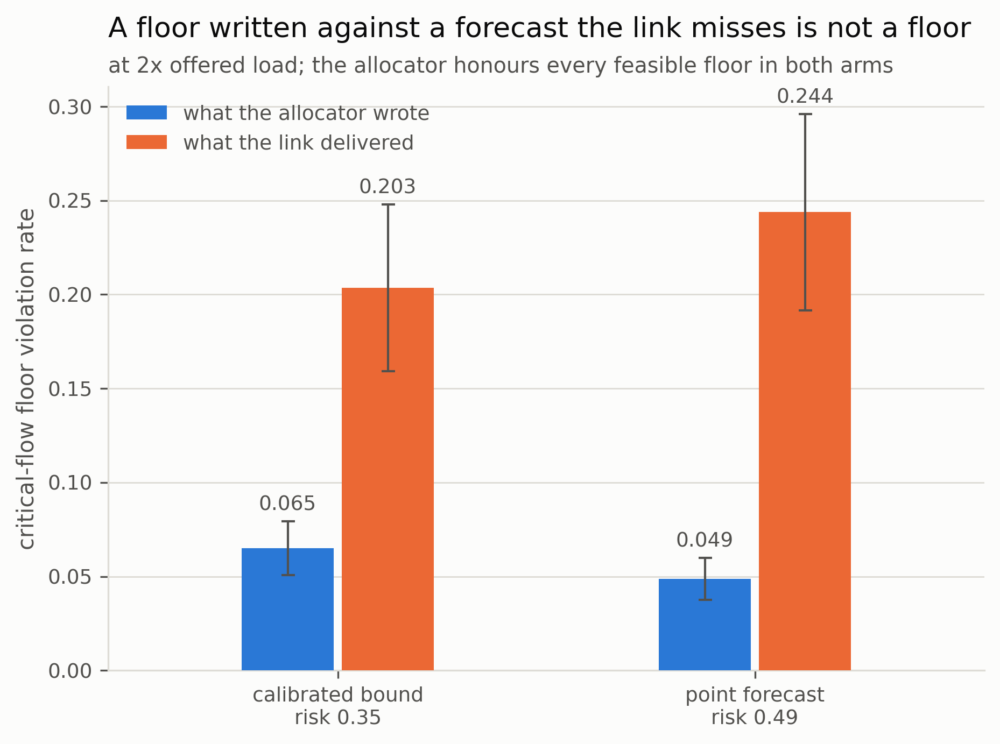

This is what ties the layer to the rest of the repository. Reserving 0.5 Mbps
for a patient monitor out of a forecast the link then fails to deliver reserves
nothing: the shortfall lands on whichever flow the transport starves first.

The allocator honours every feasible floor in both arms, so on the allocated
side the point forecast looks **better**, 0.049 against 0.065, because the
larger number lets it promise more. On the delivered side it is worse, 0.244
against 0.203. The calibrated bound runs at a risk rate of 0.351 against its
0.35 budget; the point forecast runs at 0.490.

### What each mechanism and each channel is worth

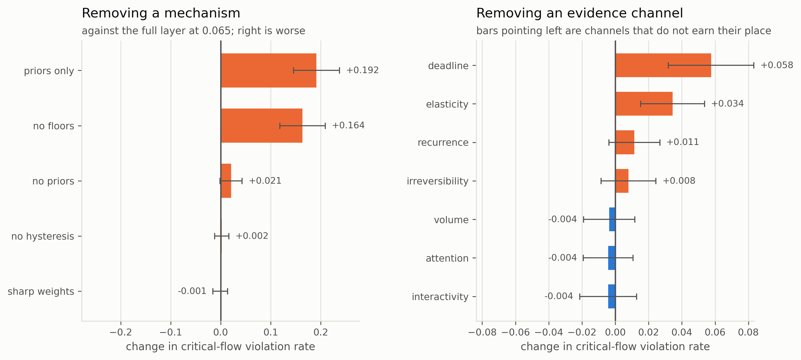

Removing the protected floors takes the violation rate from 0.065 to 0.229.
Ignoring the evidence entirely and scoring flows by their declaration alone,
which is class priority wearing this allocator, gives 0.257. Ignoring the
declarations and keeping only the evidence gives 0.086, so **the evidence
recovers almost everything the declarations provide and the declarations add
little on top.**

Two knobs move nothing in that column and are not therefore dead. The
hysteresis band holds the protection flap rate at 0.007 per flow-slot against
0.023 without it, a factor of 3.3, and every flip is a rate change the
transport underneath has to absorb.

Among the channels, only two clearly earn their weight: removing the deadline
channel costs 0.058 and removing elasticity 0.034, against a spread across
workload seeds of 0.014. Attention, interactivity and volume are neutral or
very slightly negative. **The defaults were not retuned on the strength of that
table**, because fitting the weights on the evaluation workload and then
evaluating on the same generator is exactly the circularity the module warns
about. A weight-perturbation sweep, each channel multiplied by a log-uniform
factor spanning a factor of four either way, lands between 0.048 and 0.144 over
24 draws, and **all 24 beat the best baseline at 0.150**.

### The dynamic claim, and the evidence behind one decision

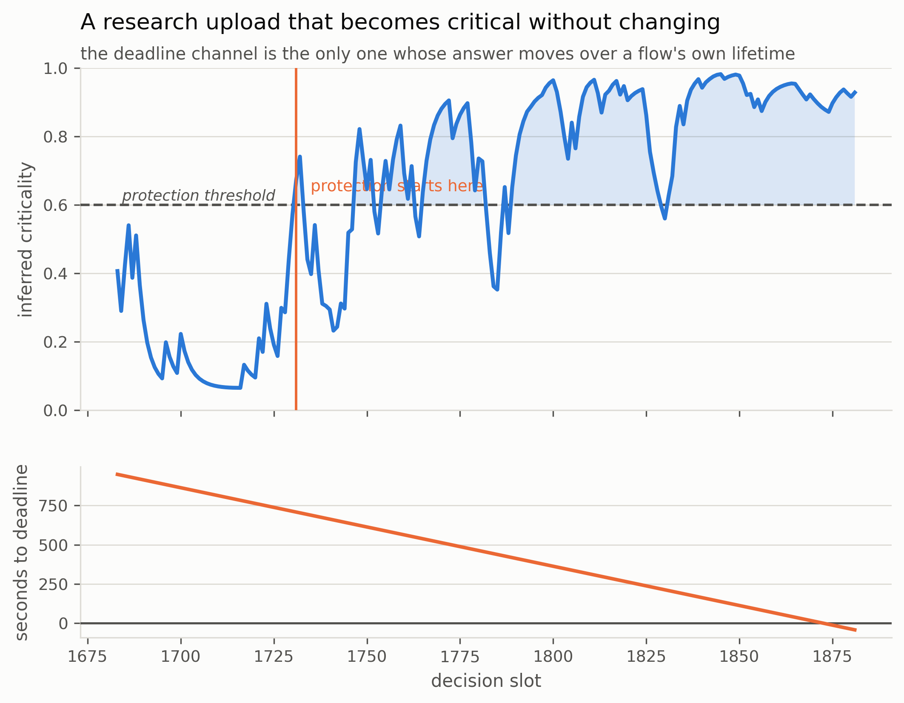

Nothing about this transfer changes over its life except how much slack is
left. That is what separates the layer from a classifier, and it is also the
channel the ablation says carries the most.

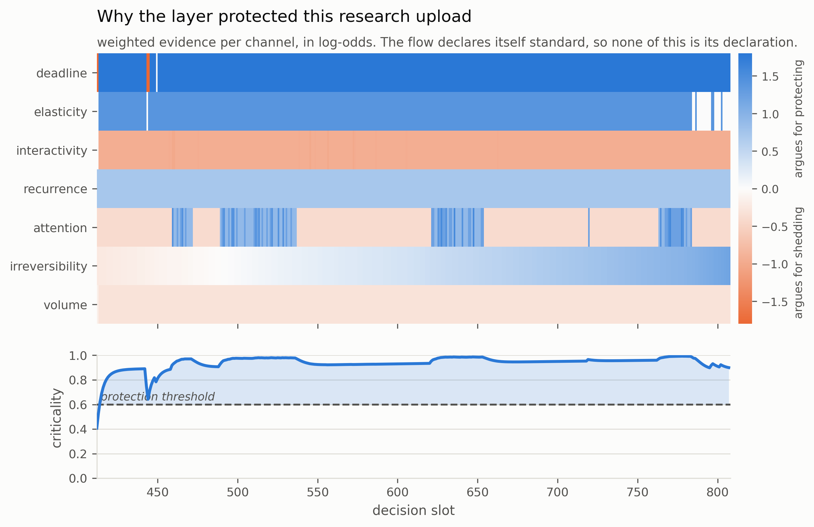

Every protection decision can be traced back to the channels that drove it,
which is the difference between a score an operator can act on and one they
cannot. The flow above declares itself `standard`, so none of this comes from
its declaration.

## Where this work fails

Four more figures, given equal room. Two of these overturned claims the project
had already made, and one of them was found by drawing a figure and looking at
it, which is why they are here rather than in a footnote.

### No covariate we have improves risk control


The project was designed around conditioning the calibration on operating
regime. On the StarNet traces, with satellite geometry **measured** rather than
reconstructed, every axis is worse than not conditioning at all, including the
elevation, distance and visible-satellite-count that objective O2 expected to
carry the signal.

StarNet establishes that those covariates correlate with throughput *level*, and
we reproduce that. They carry no *residual* structure, which is what a
calibration layer needs. **Objective O2's premise is not supported.**

Robust to the learning rate: across seven values spanning two orders of
magnitude, conditioning beat no conditioning in 8 of 42 cells, seven of them one
location.

### We could not predict when conditioning would help


Conditioning helps on one link and hurts on three, so we built a test to decide
which case a trace is in, using only the calibration split. It does not work.

If the statistic predicted the outcome these points would slope downward.
Osnabruck has the **widest** pre-test spread and gains nothing; Victoria has a
narrower one and is the only link that benefits.

We had previously reported this relationship as monotonic across four datasets.
Those figures were post-hoc, taken from offsets applied *during* the test
period. Recomputed correctly on the calibration split the ordering breaks. The
claim is withdrawn, with `results/summary/gate-negative-result.md` explaining
how it survived five files before being caught.

### The scorer cannot tell a video call from Netflix

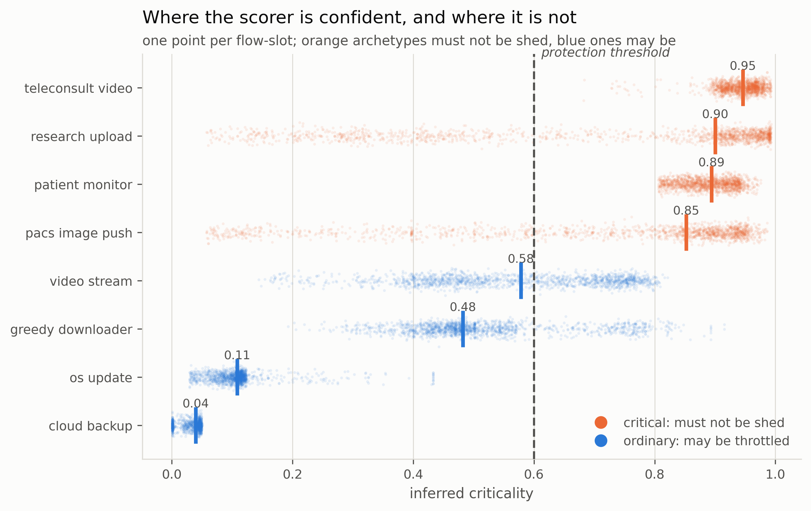

Recall is 0.894 and average precision 0.948, and detection takes a median of
2.2 decisions, about eleven seconds. Precision is 0.705, and the whole of the
shortfall has one identifiable source: an entertainment video stream and a
teleconsultation are alike on every channel this layer has. Both are inelastic,
both sit in the foreground, both show the same packet-size profile, and neither
has a deadline. The only signal that separates them is the declared class,
which is the signal the layer was built not to depend on.

A protected flow that should not have been protected costs capacity a genuinely
critical flow could have used, so it is not a free error. It is the one blue
archetype whose mass straddles the threshold in the figure.

Separately, on 23.5% of slots at this load the protected floors do not all fit.
The layer grants them in strict criticality order and reports the rest in
`AllocationResult.breached` rather than shading every floor down to a rate at
which nothing works. That field is an alarm and the answer to it is an operator
decision, not an allocation.

### Congestion alerts fire early, and often wrongly

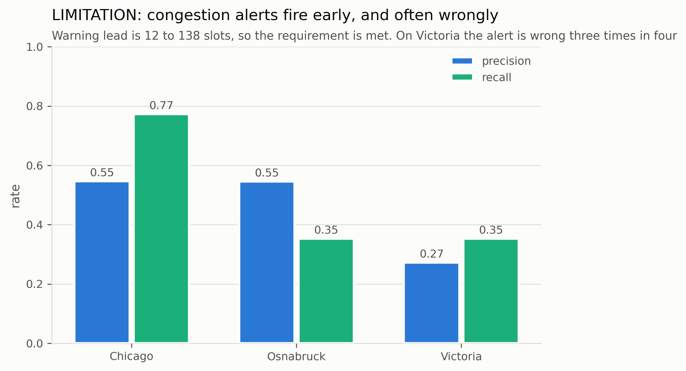

Congestion is derived from the calibrated bound rather than modelled separately,
which is what makes it nearly free. It satisfies the literal requirement:
warning leads run 12 to 138 decision slots, so the alarm does fire before users
are affected.

It is also the weakest of the six requirements. Mean F1 is 0.459, and on
Victoria the alert is wrong roughly three times in four. A derived detector
inherits the bound's variance, and a trained classifier would likely beat it.
The design trade was taken deliberately for system coherence; its cost is here
rather than hidden.

## The reproduction gates, both passed

Nothing downstream means anything until these pass. Both were run on
2026-09-01 against the released traces.

| gate | result |
|---|---|
| [StarNet](results/summary/phase1-starnet-gate.md) (Phase 1) | average RMSE 39.73 vs 39.30 published (+1.1%), MAE 29.97 vs 29.28 (+2.4%) |
| [BG-CFQS](results/summary/phase2-bgcfqs-gate.md) (Phase 2) | under an exchangeable split: OverRate 0.340 vs 0.349, P30 0.671 (pub 0.65 to 0.71), P10 0.848 (pub 0.83 to 0.86), risk pass 3/3 |

Per-location StarNet gaps are 4.2% to 6.9% and scatter in **both** directions,
which is what an independent reimplementation looks like. A reimplementation
tuned toward the target would sit just under it everywhere.

Phase 2 passed only after `scripts/split_sensitivity.py` identified the split as
the confound. BG-CFQS's guarantee holds under the exchangeability it is derived
from and does not survive a temporal split; their paper does not claim
otherwise. The detail that matters: **P10 is 0.848 in the arm where the method
passes its budget 3/3**, so the conditional failure is intrinsic to global
quantile selection rather than a symptom of drift.

## Architecture

Six layers. Each layer only talks to the one below it.

```
ingest/     raw sources to a normalized frame     (no ML, no features)
state/      frame to feature vectors + regime id  (no model)
forecast/   feature vectors to point prediction   (StarNet backbone)
calibrate/  point prediction to safe lower bound  (the risk layer)
decide/     safe bound to allocation + alerts     (no ML)
eval/       harness, splits, metrics, figures
```

`decide/` has two halves. The link half answers "how much fits": admission
control, the congestion flag, availability and cost. The flow half answers
"which flow gets it": an online criticality scorer and an allocator that
divides the same calibrated bound across contending flows under protected
floors. Nothing in either half is trained.

Two ingestion modes sit behind one interface. `ReplaySource` and the WetLinks
sources are the real path. `LiveSource` wires a terminal, a TLE feed and a
weather feed, and is a stub until a dish is available.

The design decision that makes the whole thing testable is that congestion is
**derived** rather than modelled: it is the calibrated bound sitting below the
committed allocation for a sustained window. One model, one calibration, and
every downstream signal is a decision rule on the same bound.

## Repository map

```
flwcnx/
  config.py            dataclass config, no globals
  device.py            CUDA then MPS then CPU, with a memory budget guard
  ingest/              replay, WetLinks, TLE propagation, weather, live stub
  state/               phase recovery, satellite resolution, regimes, features
  forecast/            StarNet backbone, DLinear/PatchTST/TimesNet/XGBoost
  calibrate/           split conformal, per-regime, online, BG-CFQS baseline
  decide/              admission control, congestion, SLA and cost
                       flows.py    online criticality scoring, seven channels
                       protect.py  weighted max-min fair allocation with floors
  eval/                splits, metrics, experiment runner, figures
                       workload.py the labelled flow workload (generated)
                       protection.py the protection harness and its metrics
  demo/                slot-by-slot replay engine
docs/                  paper, report, limitations, progress, references.bib
  figures/             the sixteen README figures, 300 DPI, regenerated from runs
scripts/               one entry point per experiment, plus figure and table generators
tests/                 318 tests, synthetic fixtures only
results/summary/       the committed tables (the rest of results/ is gitignored)
data/                  gitignored
```

## Contribution boundary

Being precise about this matters more than anything else in the repo.

**Reproduced from published work, not ours:**

- the StarNet GRU seq2seq backbone with periodical embedding and attention
  (Liu et al., CoNEXT 2025);
- the 2D to 3D obstruction map projection and DTW based TLE matching for
  serving satellite identification (same paper);
- the BG-CFQS budget guided coarse to fine quantile selection baseline
  (Xie et al., 2026);
- the 15 second period segmentation and phase recovery (Casparsen et al., 2026);
- one-sided split conformal prediction (Vovk, Gammerman and Shafer);
- the adaptive conformal update rule `alpha <- alpha + gamma (eps - err)`
  (Gibbs and Candès, NeurIPS 2021);
- **running that update per covariate group**, which is GCACI (Ramalingam et
  al. 2025, arXiv:2502.10947), and which POGO (arXiv:2606.00419) improves on by
  removing the learning rate. `calibrate/adaptive.py` is the naive special case
  of GCACI and was built before this was known. See `docs/novelty-assessment.md`;
- weighted max-min fairness by progressive filling (Bertsekas and Gallager
  section 6.5.2), fair queueing (Demers, Keshav and Shenker, SIGCOMM 1989) and
  per-flow guarantees (Parekh and Gallager, ToN 1993), which are the allocation
  rule and two of its baselines;
- class-based prioritisation (RFC 2474), which is the third baseline;
- deadline-driven flow scheduling (D3, SIGCOMM 2011; PDQ, SIGCOMM 2012), which
  the deadline channel uses as *evidence about criticality* rather than as the
  scheduling objective;
- sequential evidence accumulation in log-odds (Wald 1945).

**The protection layer is assembled from those parts and is not claimed as a
new mechanism.** What is specific to it is the coupling: the allocator divides
the *calibrated bound* rather than a point forecast, which is what makes a
protected floor an assertion that can be checked instead of a statement about a
number the link may not meet. The README figure that checks it is
[Why the bound and not the forecast](#why-the-bound-and-not-the-forecast).

**Ours:** measurement, not method. A literature check on 2026-09-01
(`docs/novelty-assessment.md`) found that the calibration layer this project was
designed around is already published as GCACI, so the methods claim is withdrawn
in full. What the work contributes is evidence:

1. The first evaluation of risk-controlled capacity forecasting on LEO access
   links, across four datasets and two independent measurement campaigns.
2. **BG-CFQS's risk guarantee is conditional on exchangeability**: 3/3 within
   budget under a random split, 1/3 under a temporal one.
3. **BG-CFQS cannot serve a budget below 0.15.** Their candidate set is
   T = [0.15, 0.40], so achieved OverRate pins at 0.1854 for every tighter
   budget, a 3.7x overshoot at 0.05. Their paper reports only 0.35.
4. **Static calibration misses its budget in both directions**, over on
   WetLinks and under on StarNet, so the sign is a property of the drift rather
   than the method.
5. **Group conditioning helps only when the groups differ.** The attempt to
   predict *which* case a trace is in, from the calibration split, failed:
   `results/summary/gate-negative-result.md`. Reported as a negative.
6. **The satellite covariates do not carry the signal** even when measured
   rather than reconstructed. Objective O2's premise is not supported.
7. **Casparsen's 15 s scheduling offset recovered independently** on three
   continents from a different signal at 1/500th of their sampling rate.

BG-CFQS selects one global quantile to hold the overestimation rate at the
budget. Their own results show this fails conditionally: against a budget of
0.35 they report a global OverRate of 0.349, but 0.65 to 0.71 on the lowest 30%
throughput subset and 0.83 to 0.86 on the lowest 10%. Risk is controlled on
average and lost precisely in the low capacity regime where over allocation
actually drops sessions. **That failure reproduces here on independent data**:
the uncalibrated forecaster runs at 0.505 globally and 0.841 at P10.

## Data

Nothing in `data/` is versioned. Only the download and preprocessing scripts
are.

**Primary: the StarNet traces.** Three locations at 1 Hz with serving-satellite
identity, elevation, distance, visible-satellite count and co-located weather:
Chicago (1,123,832 samples), Osnabruck (613,295) and Victoria (145,053). These
were unavailable for months, because all three OneDrive links in the authors'
repository had expired and neither the first author nor the PI replied.
[`docs/data-access.md`](docs/data-access.md) records every route that was
checked.

When they did arrive, two of the three folders were mislabelled: the one marked
`usa` contained Victoria and vice versa. Every file is identified from its
contents rather than its filename, and the loader verifies row counts and
satellite counts against the published dataset table at zero relative error.

**Second dataset: the full WetLinks release**
(<https://github.com/sys-uos/WetLinks>), 1,019,109 per-second *measured
capacity* samples. This is the workaround that kept the project running while
the traces were unavailable, and it remains the second measurement campaign the
cross-dataset claims rest on. It substitutes for the traces on everything except
serving-satellite identity, with candidate count recovered by propagating 181
consecutive days of Space-Track orbital elements against known site coordinates.

**Geometry provenance differs by source, and every claim says which.** On the
StarNet traces elevation, distance and candidate count are *measured* by the
terminal. On the WetLinks path they are *reconstructed* from propagated orbital
elements, and every row carries `geometry_source = "reconstructed"`. The
objective O2 negative result is stated on the measured geometry.

```bash
python scripts/download_data.py --dataset starnet --dest data/starnet
python scripts/download_data.py --inspect data/supplied
python scripts/fetch_elements.py            # Space-Track, needs .env credentials
```

## Running it on your machine

The project was developed on Apple silicon and is tested on Linux across Python
3.11, 3.12 and 3.13. Two portability problems were found by running it
elsewhere, and both are now handled rather than assumed away.

**Device.** `flwcnx/device.py` picks CUDA, then MPS, then CPU. An explicit
request for a device the machine does not have is a warning and a fallback, not
an error, so a run on a borrowed laptop still completes. The MPS probe is
guarded, because `torch.backends.mps` does not exist on every torch build and
the original unguarded check raised during setup.

```bash
FLWCNX_DEVICE=cpu python scripts/run_demo.py --location canada   # pin a device
```

Every result file records the device it ran on, which is what lets
`docs/limitations.md` section 4b say honestly that no result here has
independent hardware confirmation.

**Memory.** Windowing the US trace at stride 1 wants roughly 1.7 GB for the
inputs alone, before the model or the split copy. On a laptop that used to be an
OOM kill with no explanation; it is now an error naming the two knobs that fix
it:

```
windowing 1,123,802 sequences of 30 x 13 needs about 3.5 GB, over the 8.0 GB limit.
  Raise the limit:  FLWCNX_MEMORY_LIMIT_GB=4
  Or window less:   --stride 7 (currently 1)
```

The default budget is 8 GB, deliberately conservative rather than a measurement
of the host. Set `FLWCNX_MEMORY_LIMIT_GB` to raise it.

**Modest machines.** Every script takes `--stride`; raising it is the single
most effective knob. A stride above the horizon also makes scored decisions
disjoint, which is the honest denominator for a risk rate. The full test suite
needs no dataset and no GPU.

## Reproducing every number

Every table in the paper, the report and `results/summary/` comes from one of
these. Each run writes `result.json` with a configuration snapshot beside it;
the figure and table generators recompute nothing.

```bash
pytest -q                                               # 318 tests, synthetic fixtures

python scripts/reproduce_starnet.py --location all      # gate 1: StarNet accuracy
python scripts/reproduce_bgcfqs.py --all --stride 15    # gate 2: BG-CFQS risk table
python scripts/split_sensitivity.py                     # the exchangeability finding
python scripts/gamma_sensitivity.py                     # learning-rate robustness
python -m flwcnx.eval.runner --location usa --stride 6  # the full calibration grid
python scripts/run_cross_site.py --held-out Enschede    # cross-site holdout
python scripts/run_requirements.py                      # latency, availability, cost
python scripts/compare_backbones.py <run-dirs> --out <file>
python scripts/run_demo.py --location canada            # the replay demo
python scripts/run_protection.py --location canada      # the protection layer, six arms

# the WetLinks path, which is how the project ran before the traces arrived
python scripts/run_wetlinks.py --release seconds --site Osnabruck --geometry \
    --epochs 30 --stride 1 --output results/final

python scripts/make_readme_figures.py                   # seven README figures, 300 DPI
python scripts/make_protection_figures.py --run results/protection/canada   # eight more
python scripts/make_protection_summary.py results/protection/canada \
    --out results/summary/protection-canada.md
python scripts/make_figures.py <run-dir>                # per-run figures from a saved run
python scripts/make_summary.py <run-dir> --out <file>   # committed markdown tables
```

Seeded throughout (default 1337) and the seed is recorded in every result file.

## Using the protection layer

The layer is a library before it is an experiment. Two objects: a scorer that
watches flows, and an allocator that divides a capacity bound across them.

```python
from flwcnx.decide.flows import FlowClass, FlowObservation, FlowSpec
from flwcnx.decide.protect import ProtectionController

controller = ProtectionController.build()

# A radiology study against a reporting deadline. It does not declare itself,
# because the modality vendor's uploader does not set DSCP.
imaging = FlowSpec("pacs-7", declared=FlowClass.STANDARD,
                   floor_mbps=15.0, demand_mbps=28.0, bytes_total_mbit=4200.0,
                   deadline_s=180.0, resumable=False)
backup = FlowSpec("backup-2", declared=FlowClass.BACKGROUND,
                  demand_mbps=22.0, recurrence=0.95)

def observe(remaining_mbit: float, slack_s: float) -> dict:
    return {
        # Inelastic: still asking for its peak rate after being throttled.
        "pacs-7": (imaging, FlowObservation(
            demand_mbps=28.0, demand_peak_mbps=28.0, throttled_last=True,
            granted_last_mbps=9.0, mbit_up=45.0, packets_up=4_000,
            remaining_mbit=remaining_mbit, deadline_remaining_s=slack_s,
            progress=1.0 - remaining_mbit / 4200.0)),
        # Elastic: offered load has collapsed to what it was given.
        "backup-2": (backup, FlowObservation(
            demand_mbps=6.0, demand_peak_mbps=22.0, throttled_last=True,
            granted_last_mbps=6.0, mbit_up=30.0, packets_up=2_600)),
    }

# Each call is one decision. `bound_mbps` is what the calibration layer says the
# next horizon can be trusted to carry.
for slack in (150.0, 120.0, 90.0, 60.0, 30.0):
    allocation = controller.step(bound_mbps=20.0,
                                 observations=observe(2_600.0, slack))

allocation.rates                 # {"pacs-7": 18.44, "backup-2": 1.56}
allocation.protection_breached   # False: the floor fitted
controller.scorer.criticality("pacs-7")     # 0.685, above the 0.60 threshold
controller.scorer.is_protected("backup-2")  # False, and still getting 1.56 Mbps
```

Nothing about either flow changes across those five calls except the deadline
slack, and that is what moves the imaging study across the protection
threshold. On the first decision it scores 0.45 and is not protected; by the
fifth it is. The backup is throttled hard and never stopped.

Three properties hold by construction and are pinned by tests:

- **Floors are honoured whenever they jointly fit.** If the protected floors sum
  to no more than the capacity, every protected flow receives at least its floor.
- **The allocation is work conserving.** It sums to `min(capacity, total demand)`,
  so capacity a critical flow does not want is not held idle for it.
- **Nothing is halted while capacity remains.** Every weight is strictly
  positive, so a flow scored at zero criticality is throttled rather than
  stopped. Killing a connection does not save its bytes; it defers them into a
  retry, usually into the same congestion episode.

When the floors do **not** fit, no allocation satisfies them. The layer grants
floors in strict criticality order until the capacity runs out and returns the
rest in `allocation.breached`. That field is an alarm rather than a diagnostic:
it is the case where the link physically cannot carry what has been declared
critical, and the answer to it is an operator decision.

`channel_scores(spec, obs)` returns each channel's contribution, so any
protection decision can be traced back to the evidence that drove it.

## Project status

All ten build phases are complete, both reproduction gates pass, and all six of
the brief's industry needs are measured. What follows is what that does **not**
cover, stated here rather than left for a reader to discover.

**Known gaps:**

- `LiveSource.connect` still raises. There is no live terminal, and every
  result in this repository is replay over recorded traces.
- The protection layer computes rates and never enforces them. Wiring them to a
  queueing discipline on a real host is not done and is not stubbed, and it is
  not in the live demo or the web console either.
- Its evaluation rests on a modelled flow workload driven by a measured
  capacity series, because no public LEO dataset carries a flow table. See
  [`docs/limitations.md`](docs/limitations.md) section 4c.
- The Horizon hourly cross-country pull was never run, so objective O1's
  cross-location analysis rests on the StarNet locations and a two-site
  WetLinks holdout.
- On the WetLinks side, cross location means two European sites 150 km apart
  measured by the same instrument, not three continents.
- StarNet's own ablations (published 38.00 without the periodical embedding,
  37.01 without attention) have not been rerun at their configuration.
- The WetLinks 15 sample iperf run caps look-back plus horizon at 15, so
  StarNet's 30/5 and BG-CFQS's 75/15 cannot be run on that dataset.

**Known weaknesses of what does work:**

- The online layer's budget control is empirical, not a finite sample
  guarantee, and it requires outcome feedback after each decision.
- `gamma` is a single hand-set constant that should scale with regime count.
  POGO removes the parameter entirely and is the principled fix.
- Congestion detection is the weakest of the six requirements, at mean F1 0.459.
- The criticality scorer's precision is 0.705 and every point of the shortfall
  comes from one pair of archetypes it cannot separate.
- The criticality channel weights are hand set. They were not learned, because
  fitting them on the evaluation workload would be circular, and the
  perturbation sweep bounds how much the conclusions depend on them without
  saying anything about whether the channels are the right ones.
- Every reported number was computed on a single machine. CI across three
  Python versions was added afterwards and immediately found a bug the local
  suite could not see, so no result here has independent hardware confirmation.
- The shrinkage and empirical-Bayes literature was not searched, and it is where
  the conditioning negative most likely has prior work.

**Two claims were withdrawn during the project**, both caught internally: the
methods claim, by commissioning an adversarial literature review, and the
offset-spread predictor, by noticing that the gated and ungated calibrators
produced byte-identical output. Both are documented in
[`docs/progress.md`](docs/progress.md) rather than quietly removed.

[`docs/limitations.md`](docs/limitations.md) is the long version and is written
to be read before the results, not after.

## Citing

If you use this code or its findings, see [`CITATION.cff`](CITATION.cff). Please
also cite the work being evaluated:

- **StarNet** (traces and forecast backbone): Liu, Reidys, Tanveer and Vasisht,
  *Vivisecting Starlink Throughput*, Proc. ACM Netw. 3(CoNEXT4), 2025.
- **BG-CFQS** (the direct baseline): Xie et al., *Risk-Aware Safe Throughput
  Forecasting for Starlink Networks*, arXiv:2605.09508, 2026.
- **WetLinks** (the second dataset): Laniewski et al., TMA 2024.

The full bibliography, 40 entries, is [`docs/references.bib`](docs/references.bib).

## Licence

MIT, see [`LICENSE`](LICENSE). The licence covers the code only. The datasets
are redistributed by their own authors under their own terms, and several
components here are reimplementations of published methods, identified as such
in their module docstrings.
